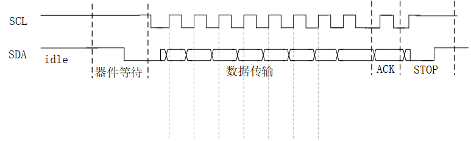
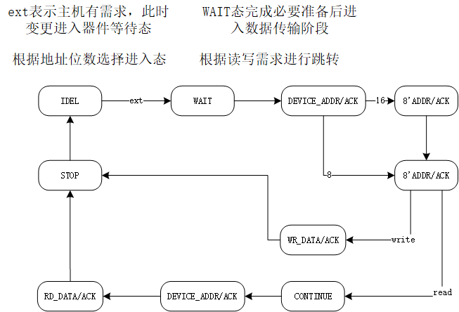

# FPGA实现I2C通信文档

## I2C时序

初始SDA控制权移交MASTER

- 单次写操作
IDEL--->SDA下拉/SLAVE等待--->SCL下拉/数据传输开始--->数据传输和SLAVE应答--->SCL上拉/SDA上升沿
数据传输格式:DEVICE_ADDR(7'b)+W(1'b0)---SDA控制移交SLAVE---ACK(1'b0表示正确应答)---SDA控制移交MASTER---WORD_ADDR(8'b)---SDA控制移交SLAVE---ACK(1'b0表示正确应答)---SDA控制移交MASTER---DATA(8'b)---SDA控制移交SLAVE---ACK(1'b0表示正确应答)---SDA控制移交MASTER---STOP阶段
对于双字地址要连续写两次WORD_ADDR(15-8,7-0)
- 页写操作
在单次写操作中重复n个DATA阶段时序,器件内部自动增待写地址,n不得大于单页数据数,否则会从头覆盖
- 随机读操作
IDEL--->SDA下拉/SLAVE等待--->SCL下拉/数据传输开始--->数据传输和SLAVE应答--->SCL上拉/SDA上升沿
数据传输格式:DEVICE_ADDR(7'b)+W(1'b0)---SDA控制移交SLAVE---ACK(1'b0表示正确应答)---SDA控制移交MASTER---WORD_ADDR(8'b)---SDA控制移交SLAVE---ACK(1'b0表示正确应答)---SDA控制移交MASTER ***上面的操作是定位当前地址到目标地址*** ---DEVICE_ADDR(7'b)+W(1'b1)---SDA控制移交SLAVE---ACK(1'b0表示正确应答)---SDA控制移交MASTER---DATA(8'b)---SDA控制移交SLAVE---ACK(1'b1表示非应答)---SDA控制移交MASTER---STOP阶段
- 顺序读操作
在随机读的基础上重复读DATA周期,只不过除最后一次外都返回ACK(1'b0表示正确应答信号)

## I2C-FSM控制

仅实现单次写和随机读且将二者合并,前序共用

## .v文件

i2c_dri.v用于i2c状态机和scl,sda信号输出,接收主机传输需求,是i2c驱动实现的主代码
